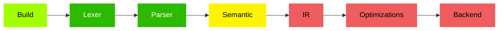

# Golden Programming Language

This project aims to create a programming language that is simple but expressive, that is easy to learn and write but also easy to read and understand, that supports complex programs but encorages simple arquitectures. 

The Golden Programming Language is a procedural, static and strong typed language based on Go and Gleam, borrowing some inspirations from other languages such as Rust, Austral and other functional languages.

> This repository contains ongoing work and most of the content here is dynamic or temporary accordingly to the development phase.

## Current State



Legend:

- <span style="color:#F05D5E">Not Started</span>
- <span style="color:#ffa700">Temporary</span>
- <span style="color:#fff400">Experiment</span>
- <span style="color:#a3ff00">Partially Stable</span>
- <span style="color:#2cba00">Stable</span>

| Step          | Description                                                  |
|---------------|--------------------------------------------------------------|
| Build         | Package loading, module loading, caching, etc.               |
| Lexer         | Convertion of source code into tokens.                       |
| Parser        | Convertion of the tokens into AST .                          |
| Semantic      | Type check, inference, and other coding analysis and checks. |
| IR            | Convertion of the AST into an intermediate representation.   |
| Optimizations | Optimizations over the IR.                                   |
| Backend       | Code Generation or interpretation.                           |

## The Language Foundation

> For now, this section is for development reference only.

Design Pillars:

- **Consistency With Ergonomy**
- **Intuitive Simplicity**
- **Safety With Flexibility**

The foundation is a core set of features that defines the minimum base of the language, which will support all following developments. They should be simple to expand and useful enough to be used without additions.

### Modules, Packages and Imports
  - Modules are files
  - Packages are folders
  - `@` denotes the main package (root package of the project)
  - Packages cannot have circular dependency
  - Modules inside the same package auto import other modules
  - `import <package>*/<module>` is the base syntax

### Visibility

Definitions (both types and variables) starting with `_` are private and can only be accessed inside the module it was declared. 

### Expressions

Expressions are terms that will be evaluated to a value and everything in the language is an expression, however, some just evaluates to `void`.

Anywhere a term asks for an expression, you can use a block instead, i.e. `{}`, which will return the last list executed. Empty blocks also evaluates to `void`.

Notice that common mathematical expressions should use `{}` instead of `()`:

```rust
{x*x} + {y*y}
```

### Bindings

Bindings assign an expression to a name, which will be registered in the scope.

```rust
let pi = 3.1415      // Inferred type
let time Float = 10  // Complete information
let name String      // Default initialization
```

Variables are immutable by default and cannot be reassigned. However, they may be redeclared:

```rust
let x = 1
let x = "renato"
```

### Functions

Functions can be declared as:

```rust
fn add(a Int, b Int) Int { a + b }

add(1, 2)
```

Functions declared with a name inserts the name into the scope and is equivalent to:

```rust
let add = fn(a Int, b Int) Int { a + b }
```

Function type notation is a bit special:

```rust
let mult = fn(x Int) Fn(Int, Int) Int {
  fn (a Int, b Int) { {a + b}*x }
}
```

### Types

Golden have the following primitive types:

- `Void`
- `Bool`
- `Int`
- `Float`
- `String`
- `Fn`

