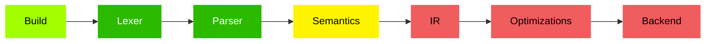

# Golden Programming Language

This project aims to create a programming language that is simple but expressive, that is easy to learn and write but also easy to read and understand, that supports complex programs but encorages simple arquitectures. 

The Golden Programming Language is a procedural, static and strong typed language based on Go and Gleam, borrowing some inspirations from other languages such as Rust, Austral and other functional languages.

The language is under development, starting from the basic structure and growing progressively. You can check it out the development status in the section below.

## How Does It Looks Like?

Golden follows a minimalistic traditional syntax based on procedural languages:

```c
fn main() {
  print('Hello, World. 🌍')
}
```

[Check it out the language documentation](./.docs/index.md) for more information.


## Development State

### Compiler



Legend:

- <span style="color:#F05D5E">Not Started</span>
- <span style="color:#ffa700">Temporary</span>
- <span style="color:#fff400">Experiment</span>
- <span style="color:#a3ff00">Partially Stable</span>
- <span style="color:#2cba00">Stable</span>

| Step          | Description                                                  |
|---------------|--------------------------------------------------------------|
| Build         | Package loading, module loading, caching, etc.               |
| Lexer         | Convertion of source code into tokens.                       |
| Parser        | Convertion of the tokens into AST .                          |
| Semantics     | Type check, inference, and other coding analysis and checks. |
| IR            | Convertion of the AST into an intermediate representation.   |
| Optimizations | Optimizations over the IR.                                   |
| Backend       | Code Generation or interpretation.                           |

### Language

- Modules, Packages and Imports
- Primitive Types: `Int`, `String`, `Float`, `Bool`
- Immutable Variables; `let`
- Functions: `Fn` type, functions declaration, closure

