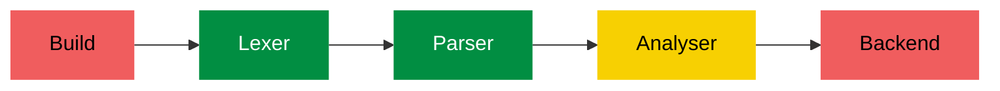

# Golden Programming Language

This project aims to create a programming language that is simple but expressive, that is easy to learn and write but also easy to read and understand, that supports complex programs but encorages simple arquitectures. 

The Golden Programming Language is a procedural, static and strong typed language based on Go and Gleam, borrowing some inspirations from other languages such as Rust, Austral and other functional languages.

> This repository contains ongoing work and most of the content here is dynamic or temporary accordingly to the development phase.

## Current State

| Step     | Progress                                        | Description                                           |
|----------|-------------------------------------------------|-------------------------------------------------------|
| Build    | uncertain    | Package loading, module loading, caching, etc.        |
| Lexer    | certain      | Lexer working as intended.                            |
| Parser   | certain      | Parser working as intended.                           |
| Analyser | fair certain | Testing type checks and type inference.               |
| Backend  | uncertain    | Unsure about which backend to use. Probabily using C. |

## The Language Foundation

> For now, this section is for development reference only.

Design Pillars:

- **Consistency With Ergonomy**
- **Intuitive Simplicity**
- **Safety With Flexibility**

The foundation is a core set of features that defines the minimum base of the language, which will support all following developments. They should be simple to expand and useful enough to be used without additions.

### The Foundation

- Modules, Packages and Imports
  - Modules are files
  - Packages are folders
  - `@` denotes the main package (root package of the project)
  - Packages cannot have circular dependency
  - Modules inside the same package auto import other modules
  - `import <package>*/<module>` is the base syntax

- Visibility
  - The prefix `_` marks the name as private and cannot be accessed outside the module

- Bindings
  - Variables can be named as the regex: `_?[a-z]([a-z][A-Z][0-9]_)*`
    - first letter MUST be lower case
    - optionally, it can have a single `_` as first character
  - Variables are declared as:
    - `let <name> = <expression>` with compiler deciding the type
    - `let <name> <typeref>` with default initialization
    - `let <name> <typeref> = <expression>` with complete information
  - Variables are immutable by default, thus:
    - It cannot have reassignment
    - It can be passed as argument
    - It can be redeclared and shadowed

- Functions
  - Functions are expressions
  - Function declaration follows:
    - `fn <params> <return>: <expression>`
  - The form `fn <name><params><return>: <expression>` can be used instead of
    `let <name> = fn <params><return>: <expression>` for simplicity.
  - Functions can be called
  - Functions are first class
  - Functions must have closure

- Types
  - Basic types: `Integer`, `Float`, `Bool` and `String`
  - Algebraic data types can be defined by `type <Name> = <Constructor> | <Constructor> ...`
  - Constructors can be tuple or struct `<Name>(Type)` or `<Name>(field Type)`
  - Types with constructors of the same name can be written as `type <Name>(...)`
